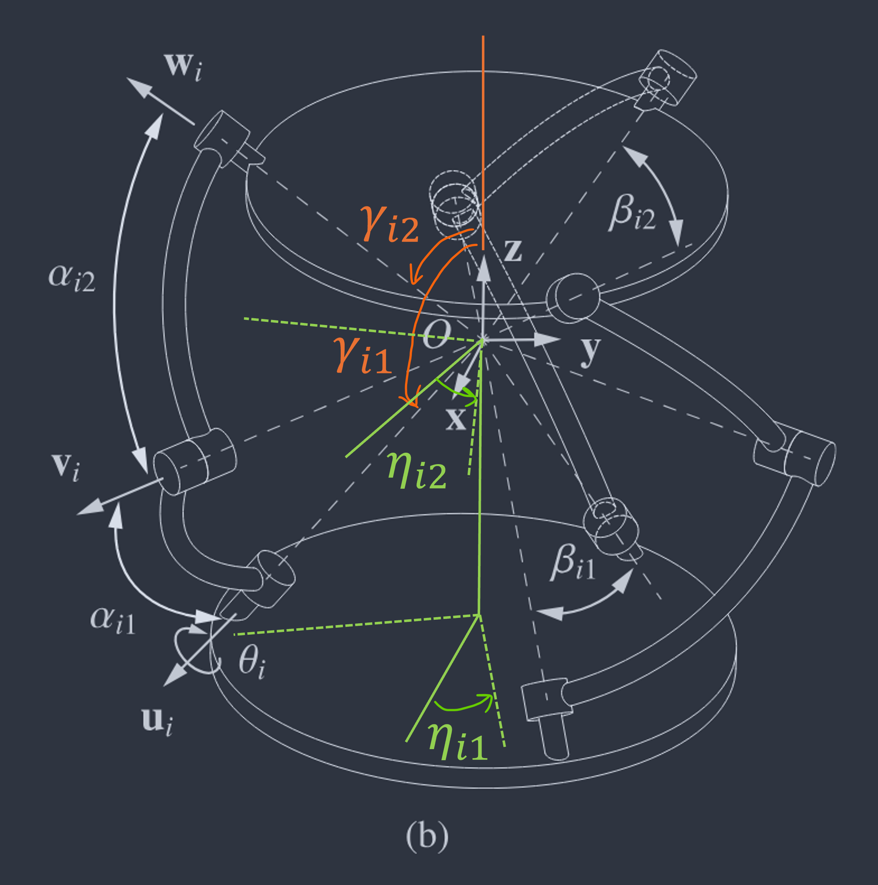

# SPM Kinematics — Technical Reference

**Mechanism:** Agile Eye-type 3-RRR Spherical Parallel Mechanism (SPM)
**Implementation:** `src/mSPMModel.cpp` · `include/mSPMModel.h`

---

## Table of Contents

1. [Mechanism Overview](#1-mechanism-overview)
2. [Architecture Parameters](#2-architecture-parameters)
3. [Joint Axis Vectors](#3-joint-axis-vectors)
4. [Proximal Link Parameterisation](#4-proximal-link-parameterisation)
5. [Inverse Kinematics (IK)](#5-inverse-kinematics-ik)
6. [Velocity Jacobian](#6-velocity-jacobian)
7. [Forward Kinematics (FK)](#7-forward-kinematics-fk)
8. [Rotation Recovery — SVD Polar Decomposition](#8-rotation-recovery--svd-polar-decomposition)
9. [Link Surpass Detection](#9-link-surpass-detection)
10. [Math Utilities](#10-math-utilities)
11. [Default Architecture Values](#11-default-architecture-values)

---

## 1. Mechanism Overview

The 3-RRR SPM has three identical legs, each with three revolute joints whose axes intersect at a common point (the centre of the sphere). The platform orientation is fully described by a rotation matrix $\mathbf{R} \in SO(3)$.

Each leg $i$ has three joint axes:

| Symbol | Description | Frame |
|--------|-------------|-------|
| $\mathbf{u}_i$ | First joint axis (base) | World frame, fixed |
| $\mathbf{v}_i(\theta_i)$ | Second joint axis (proximal link tip) | World frame, depends on $\theta_i$ |
| $\mathbf{w}_i$ | Third joint axis (moving platform side) | World frame, $= \mathbf{R}\,\mathbf{w}_{i0}$ |

$\mathbf{w}_{i0}$ is the third joint axis expressed in the **moving platform body frame** (constant).



---

## 2. Architecture Parameters

Stored in `SPMArch`:

| Field | Symbol | Description |
|-------|--------|-------------|
| `eta_i1[i]` | $\eta_{i1}$ | Azimuthal angle of the $i$-th base joint axis |
| `eta_i2[i]` | $\eta_{i2}$ | Azimuthal angle of the $i$-th platform joint axis |
| `gamma_i1[i]` | $\gamma_{i1}$ | Tilt angle of the $i$-th base joint axis |
| `gamma_i2[i]` | $\gamma_{i2}$ | Tilt angle of the $i$-th platform joint axis |
| `alpha_i1[i]` | $\alpha_{i1}$ | Spherical link length of the proximal link — arc angle between $\mathbf{u}_i$ and $\mathbf{v}_i$ axes; equivalently, the half-cone angle of the cone swept by $\mathbf{v}_i$ as $\theta_i$ varies |
| `alpha_i2[i]` | $\alpha_{i2}$ | Spherical link length of the distal link — arc angle between $\mathbf{v}_i$ and $\mathbf{w}_i$ axes; equivalently, the half-cone angle of the cone swept by $\mathbf{w}_i$ |

---

## 3. Joint Axis Vectors

All joint axes lie on the unit sphere and are computed by rotating the $z$-axis:

$$
R_z(\eta)\, R_x(\gamma)\, \hat{z}
= \begin{bmatrix} \sin\eta\sin\gamma \\ -\cos\eta\sin\gamma \\ \cos\gamma \end{bmatrix}
$$

Applied to each leg:

$$
\mathbf{u}_i = R_z(\eta_{i1})\,R_x(\gamma_{i1})\,\hat{z} \quad \text{(base, fixed in world)}
$$

$$
\mathbf{w}_{i0} = R_z(\eta_{i2})\,R_x(\gamma_{i2})\,\hat{z} \quad \text{(platform, fixed in body frame)}
$$

$$
\mathbf{w}_i = \mathbf{R}\,\mathbf{w}_{i0} \quad \text{(platform axis in world frame)}
$$

Implementation: `SPMModel::computeJointVector(eta, gamma)` → `mSPMModel.cpp:448`

---

## 4. Proximal Link Parameterisation

The second joint axis $\mathbf{v}_i$ traces a circular arc on the sphere as $\theta_i$ varies:

$$
\mathbf{v}_i(\theta_i) =
\begin{bmatrix}
a_1\cos\theta_i + b_1\sin\theta_i + c_1 \\
a_2\cos\theta_i + b_2\sin\theta_i + c_2 \\
a_3\cos\theta_i + c_3
\end{bmatrix}
$$

Coefficients are precomputed at construction from $(\eta_{i1},\, \gamma_{i1},\, \alpha_{i1})$:

$$
\begin{aligned}
a_1 &= \sin\eta_{i1}\cos\gamma_{i1}\sin\alpha_{i1} & b_1 &= \cos\eta_{i1}\sin\alpha_{i1} & c_1 &= \sin\eta_{i1}\sin\gamma_{i1}\cos\alpha_{i1} \\
a_2 &= -\cos\eta_{i1}\cos\gamma_{i1}\sin\alpha_{i1} & b_2 &= \sin\eta_{i1}\sin\alpha_{i1} & c_2 &= -\cos\eta_{i1}\sin\gamma_{i1}\cos\alpha_{i1} \\
a_3 &= -\sin\gamma_{i1}\sin\alpha_{i1} & & & c_3 &= \cos\gamma_{i1}\cos\alpha_{i1}
\end{aligned}
$$

The arc parameterisation satisfies the proximal link constraint for all $\theta_i$:

$$
\mathbf{u}_i \cdot \mathbf{v}_i(\theta_i) = \cos\alpha_{i1}
$$

Implementation: `SPMModel::computeVVector(...)` → `mSPMModel.cpp:456`

---

## 5. Inverse Kinematics (IK)

**Input:** Rotation matrix $\mathbf{R} \in SO(3)$
**Output:** Joint angles $\theta_i$ for each leg (up to 2 solutions per leg)

### Derivation

The distal link constraint requires:

$$
\mathbf{v}_i(\theta_i) \cdot \mathbf{w}_i = \cos\alpha_{i2}
$$

Substituting $\mathbf{w}_i = \mathbf{R}\,\mathbf{w}_{i0}$ and expanding $\mathbf{v}_i(\theta_i)$ gives a linear combination in $\cos\theta_i$ and $\sin\theta_i$:

$$
A_i\cos\theta_i + B_i\sin\theta_i = C_i
$$

where, with $[w_x,\, w_y,\, w_z]^\top = \mathbf{R}\,\mathbf{w}_{i0}$:

$$
\begin{aligned}
A_i &= w_x\,a_1 + w_y\,a_2 + w_z\,a_3 \\
B_i &= w_x\,b_1 + w_y\,b_2 \quad (b_3 = 0 \text{ by construction}) \\
C_i &= \cos\alpha_{i2} - (w_x\,c_1 + w_y\,c_2 + w_z\,c_3)
\end{aligned}
$$

### Solution

Solved via the **Weierstrass half-angle substitution** $t = \tan(\theta/2)$:

$$
\cos\theta = \frac{1-t^2}{1+t^2}, \qquad \sin\theta = \frac{2t}{1+t^2}
$$

Substituting and multiplying through by $(1+t^2)$ reduces the equation to a quadratic in $t$:

$$
(A_i + C_i)\,t^2 - 2B_i\,t + (C_i - A_i) = 0
$$

Solved by `solveQuadratic()`. A solution exists only when $A_i^2 + B_i^2 \geq C_i^2$.

Each leg yields **0, 1, or 2** solutions. The active branch per leg is tracked by `theta_sol_indices[i]` (default `0`).

**Result structure:** `IKResult` — `theta[i][0..1]`, `has_solution[i]`, `num_solutions[i]`

Implementation: `SPMModel::computeIK(R, update_config)` → `mSPMModel.cpp:560`

---

## 6. Velocity Jacobian

**Input:** Current configuration (requires prior `computeIK(..., update_config=true)`)
**Output:** Forward Jacobian $\mathbf{J}$ such that $\boldsymbol{\omega} = \mathbf{J}\,\dot{\boldsymbol{\theta}}$

### Derivation

Differentiating the constraint $\mathbf{v}_i \cdot \mathbf{w}_i = \cos\alpha_{i2}$ with respect to time:

$$
\dot{\mathbf{v}}_i \cdot \mathbf{w}_i + \mathbf{v}_i \cdot \dot{\mathbf{w}}_i = 0
$$

Using $\dot{\mathbf{w}}_i = \boldsymbol{\omega} \times \mathbf{w}_i$ (rigid body rotation):

$$
\dot{\mathbf{v}}_i \cdot \mathbf{w}_i + (\mathbf{w}_i \times \mathbf{v}_i) \cdot \boldsymbol{\omega} = 0
$$

The first term relates to the joint velocity: $\dot{\mathbf{v}}_i \cdot \mathbf{w}_i = [\mathbf{u}_i \cdot (\mathbf{w}_i \times \mathbf{v}_i)]\,\dot{\theta}_i$

Stacking all three legs:

$$
\mathbf{A}\,\boldsymbol{\omega} = \mathbf{B}\,\dot{\boldsymbol{\theta}}
$$

where:

$$
\mathbf{A}_{i,:} = \mathbf{w}_i \times \mathbf{v}_i, \qquad
\mathbf{B}_{ii} = \mathbf{u}_i \cdot (\mathbf{w}_i \times \mathbf{v}_i)
$$

The forward Jacobian is:

$$
\mathbf{J} = \mathbf{A}^{-1}\mathbf{B}, \qquad \boldsymbol{\omega} = \mathbf{J}\,\dot{\boldsymbol{\theta}}
$$

$\mathbf{A}$ is inverted analytically via `Matrix33f::Invert`. If $|\det\mathbf{A}| < 10^{-6}$ the configuration is singular and `is_valid = false`.

**Result structure:** `VelJacobian` — `J`, `A_mat`, `B_mat`, `is_valid`

Implementation: `SPMModel::computeVelJacobian()` → `mSPMModel.cpp:615`

---

## 7. Forward Kinematics (FK)

**Input:** Joint angles $\theta_i,\ i=0,1,2$
**Output:** Third joint axis vectors $\mathbf{w}_i$ and rotation matrix $\mathbf{R}$

### Constraint System

The 9 scalar constraints on $\mathbf{x} = [\mathbf{w}_0^\top\ \mathbf{w}_1^\top\ \mathbf{w}_2^\top]^\top$ (9 unknowns):

| Index | Equation | Type |
|-------|----------|------|
| $F_0$ | $\mathbf{v}_0(\theta_0)\cdot\mathbf{w}_0 = \cos\alpha_{02}$ | Distal alignment, leg 0 |
| $F_1$ | $\mathbf{v}_1(\theta_1)\cdot\mathbf{w}_1 = \cos\alpha_{12}$ | Distal alignment, leg 1 |
| $F_2$ | $\mathbf{v}_2(\theta_2)\cdot\mathbf{w}_2 = \cos\alpha_{22}$ | Distal alignment, leg 2 |
| $F_3$ | $\mathbf{w}_1\cdot\mathbf{w}_2 = \mathbf{w}_{10}\cdot\mathbf{w}_{20}$ | Platform inter-axis angle (1–2) |
| $F_4$ | $\mathbf{w}_2\cdot\mathbf{w}_0 = \mathbf{w}_{20}\cdot\mathbf{w}_{00}$ | Platform inter-axis angle (2–0) |
| $F_5$ | $\mathbf{w}_0\cdot\mathbf{w}_1 = \mathbf{w}_{00}\cdot\mathbf{w}_{10}$ | Platform inter-axis angle (0–1) |
| $F_6$ | $\|\mathbf{w}_0\| = 1$ | Unit norm |
| $F_7$ | $\|\mathbf{w}_1\| = 1$ | Unit norm |
| $F_8$ | $\|\mathbf{w}_2\| = 1$ | Unit norm |

The inter-axis dot products $\mathbf{w}_{i0}\cdot\mathbf{w}_{j0}$ are constant (rigid platform), precomputed and stored in `c3[0..2]`.

### Analytical Jacobian of F

The $9\times9$ Jacobian $\mathbf{J}_F = \partial\mathbf{F}/\partial\mathbf{x}$ has a sparse, structured form:

$$
\mathbf{J}_F = \begin{bmatrix}
\mathbf{v}_0^\top & \mathbf{0} & \mathbf{0} \\
\mathbf{0} & \mathbf{v}_1^\top & \mathbf{0} \\
\mathbf{0} & \mathbf{0} & \mathbf{v}_2^\top \\
\mathbf{0} & \mathbf{w}_2^\top & \mathbf{w}_1^\top \\
\mathbf{w}_2^\top & \mathbf{0} & \mathbf{w}_0^\top \\
\mathbf{w}_1^\top & \mathbf{w}_0^\top & \mathbf{0} \\
2\mathbf{w}_0^\top & \mathbf{0} & \mathbf{0} \\
\mathbf{0} & 2\mathbf{w}_1^\top & \mathbf{0} \\
\mathbf{0} & \mathbf{0} & 2\mathbf{w}_2^\top
\end{bmatrix}
$$

### Gauss-Newton Dogleg Solver

The system $\mathbf{F}(\mathbf{x}) = \mathbf{0}$ is solved by minimising $f(\mathbf{x}) = \tfrac{1}{2}\|\mathbf{F}(\mathbf{x})\|^2$ using a **trust-region dogleg** method.

**Normal equations** at each iteration:

$$
\mathbf{B}_{GN} = \mathbf{J}_F^\top \mathbf{J}_F, \qquad \mathbf{g} = \mathbf{J}_F^\top \mathbf{F}
$$

$\mathbf{B}_{GN}$ is symmetric positive semi-definite and solved via **Cholesky factorisation** $\mathbf{B}_{GN} = \mathbf{L}\mathbf{L}^\top$ with forward/back substitution.

**Dogleg step** $\mathbf{p}$:

1. **Newton step** $\mathbf{p}_N$: solve $\mathbf{B}_{GN}\,\mathbf{p}_N = -\mathbf{g}$
2. If $\|\mathbf{p}_N\| \leq \Delta$ (inside trust region) $\Rightarrow$ $\mathbf{p} = \mathbf{p}_N$
3. **Cauchy step** $\mathbf{p}_U = -\dfrac{\|\mathbf{g}\|^2}{\mathbf{g}^\top \mathbf{B}_{GN}\,\mathbf{g}}\,\mathbf{g}$
4. If $\|\mathbf{p}_U\| \geq \Delta$ $\Rightarrow$ $\mathbf{p} = \Delta\,\mathbf{p}_U / \|\mathbf{p}_U\|$
5. Otherwise $\Rightarrow$ interpolate $\mathbf{p}_U \to \mathbf{p}_N$ to hit the trust-region boundary $\Delta$

**Trust-region update** ($\rho$ = actual / predicted reduction):

| $\rho$ | Action |
|--------|--------|
| $< 0.25$ | $\Delta \leftarrow 0.25\,\Delta$ (shrink) |
| $> 0.75$ and step on boundary | $\Delta \leftarrow \min(2\Delta,\,\Delta_{\max})$ (expand) |
| $> \eta\ (= 0.1)$ | Accept step |

**Convergence criteria** (any triggers success):

$$
\|\mathbf{g}\| < 10^{-6}, \qquad \|\mathbf{p}\| < 10^{-7}, \qquad |\Delta f| < 10^{-10}
$$

Maximum iterations: 100. Declared converged when $f(\mathbf{x}^*) < 10^{-6}$.

**Initial guess options:**

| `init_prev_sol` | Starting point |
|-----------------|----------------|
| `false` (cold) | $\mathbf{w}_{i0}$ — body-frame vectors (neutral pose) |
| `true` (warm) | $\mathbf{w}_i$ — last accepted configuration |

Implementation: `fk_solve()` / `fk_residual_and_jac()` → `mSPMModel.cpp:59–255`

---

## 8. Rotation Recovery — SVD Polar Decomposition

After the FK solver converges, $\mathbf{R}$ is recovered from the solved $\mathbf{w}_i$ vectors.

### Construction of M

$$
\mathbf{M} = \sum_i \mathbf{w}_i\,\mathbf{w}_{i0}^\top = \mathbf{W}_\text{sol}\,\mathbf{W}_0^\top
$$

where $\mathbf{W}_\text{sol} = [\mathbf{w}_0\ \mathbf{w}_1\ \mathbf{w}_2]$ and $\mathbf{W}_0 = [\mathbf{w}_{00}\ \mathbf{w}_{10}\ \mathbf{w}_{20}]$ are $3\times3$ matrices with column vectors.

When the FK has converged, $\mathbf{w}_i = \mathbf{R}\,\mathbf{w}_{i0}$, so:

$$
\mathbf{M} = \mathbf{R}\,\mathbf{W}_0\,\mathbf{W}_0^\top
$$

The polar factor of $\mathbf{M}$ equals $\mathbf{R}$ since $\mathbf{W}_0\mathbf{W}_0^\top$ is symmetric PSD.

### Why SVD, not Newton Iteration

The default SPM has $\gamma_{i2} \approx 85°$, so all $\mathbf{w}_{i0}$ vectors have very small $z$-components ($\approx \cos 85° \approx 0.087$). This makes $\mathbf{W}_0\mathbf{W}_0^\top$ ill-conditioned:

$$
\sigma_{\min}(\mathbf{W}_0\mathbf{W}_0^\top) \approx 0.023, \quad \sigma_{\max} \approx 1.49, \quad \kappa \approx 65
$$

The Newton polar iteration maps each singular value $\sigma \mapsto (\sigma + 1/\sigma)/2$. Starting from $\sigma = 0.023$ takes $\approx 8$ steps to reach $\sigma = 1$; with only 5 iterations the result was $m_{33} \approx 1.6$ instead of $1.0$.

SVD computes the polar factor exactly in one pass, independent of conditioning.

### Algorithm: Jacobi SVD

**Step 1** — Form $\mathbf{B} = \mathbf{M}^\top\mathbf{M}$ (symmetric PSD, $3\times3$)

**Step 2** — Jacobi diagonalisation of $\mathbf{B}$ (up to 30 sweeps):

Each sweep finds the largest off-diagonal entry $|B_{pq}|$ and zeros it with a Givens rotation $J(p,q,\theta)$:

$$
\tau = \frac{B_{qq} - B_{pp}}{2\,B_{pq}}, \qquad
t = \frac{\operatorname{sign}(\tau)}{|\tau| + \sqrt{1+\tau^2}}, \qquad
c = \frac{1}{\sqrt{1+t^2}}, \quad s = t\,c
$$

Symmetric update $\mathbf{B} \leftarrow J^\top \mathbf{B}\, J$ (only 5 entries change):

$$
\begin{aligned}
B_{pp} &\leftarrow B_{pp} - t\,B_{pq} \\
B_{qq} &\leftarrow B_{qq} + t\,B_{pq} \\
B_{pq} &= B_{qp} \leftarrow 0 \\
B_{rp} &\leftarrow c\,B_{rp} - s\,B_{rq} \quad (r \neq p,q) \\
B_{rq} &\leftarrow s\,B_{rp} + c\,B_{rq}
\end{aligned}
$$

Eigenvector accumulation $\mathbf{V} \leftarrow \mathbf{V}\,J$:

$$
V_{rp} \leftarrow c\,V_{rp} - s\,V_{rq}, \qquad V_{rq} \leftarrow s\,V_{rp} + c\,V_{rq}
$$

Convergence: $\max_{p\neq q}|B_{pq}| < 10^{-12}$.

**Step 3** — Extract singular values and right singular vectors:

$$
\sigma_i = \sqrt{|B_{ii}|}, \qquad \mathbf{V}_{:,i} = \mathbf{V}_{\text{accumulated}\ :,i}
$$

**Step 4** — Left singular vectors via column normalisation:

$$
\mathbf{col}_j = \mathbf{M}\,\mathbf{v}_j, \qquad \mathbf{u}_j = \frac{\mathbf{col}_j}{\|\mathbf{col}_j\|} \quad (\|\mathbf{col}_j\| = \sigma_j \text{ for unit } \mathbf{v}_j)
$$

### Polar Factor and det-Correction

$$
\mathbf{R} = \mathbf{U}\,\mathbf{V}^\top
$$

If $\det(\mathbf{R}) = -1$ (reflection), flip the $\mathbf{U}$ column for the smallest $\sigma$:

$$
\mathbf{U}_{:,\,\arg\min\sigma} \leftarrow -\mathbf{U}_{:,\,\arg\min\sigma}, \qquad \mathbf{R} \leftarrow \mathbf{U}\,\mathbf{V}^\top \quad \Rightarrow \det(\mathbf{R}) = +1
$$

This is the **Kabsch correction**, giving the nearest proper rotation in $SO(3)$.

Implementation: `svd3x3()` / `det3()` / `polar3()` → `mSPMModel.cpp:293–415`

---

## 9. Link Surpass Detection

**Only valid for the coaxial case** ($\gamma_{i1} = 0$ for all legs).

### Problem

In the coaxial SPM the three base joint axes $\mathbf{u}_i$ all share the same $z$-axis. The input angles $\theta_i$ therefore live on a common circle. A **surpass** occurs when one link overtakes another — the cyclic order 1→2→3 is violated — which is a physically infeasible configuration that the controller must avoid.

### Adjusted Angles

Each raw joint angle is shifted by the base azimuth $\eta_{i1}$ and wrapped to $[0,\,2\pi)$:

$$
a_i = (\theta_i + \eta_{i1}) \bmod 2\pi, \qquad
x \bmod m \;=\; x - m\left\lfloor\dfrac{x}{m}\right\rfloor
$$

The floor-based modulo is used (not `fmod`) so the result is always non-negative, correctly handling both negative angles and angles beyond $2\pi$.

### CCW Arc

The counter-clockwise arc from $a_p$ to $a_q$ on the circle is:

$$
\text{ccw}(a_p, a_q) = (a_q - a_p) \bmod 2\pi \;\in\; [0,\,2\pi)
$$

### Surpass Test

The three adjusted angles are in valid CCW cyclic order 1→2→3 if and only if:

$$
\text{ccw}(a_0,a_1) + \text{ccw}(a_1,a_2) + \text{ccw}(a_2,a_0) = 2\pi
$$

Any other sum indicates at least one surpass. The check uses a tolerance of $10^{-5}$ rad to guard against floating-point rounding.

### Margin Test

After confirming no surpass, the **shortest arc** between each adjacent pair is checked against a minimum separation margin $\delta$:

$$
\text{shortest}_{ij} = \min\!\bigl(\text{ccw}(a_i,a_j),\; 2\pi - \text{ccw}(a_i,a_j)\bigr) < \delta - \varepsilon
$$

The $\varepsilon = 10^{-6}$ rad tolerance ($\approx 0.00006°$) prevents false positives from float32 rounding when the gap is computed via a different arithmetic path than the margin (e.g. two legs that are nominally 10° apart may evaluate to $10° - \epsilon$ in float32).

### Known Limitation — Double Surpass

If two pairs surpass simultaneously (e.g. leg 0 passes leg 1 **and** leg 1 passes leg 2), the three CCW arcs can still sum to $2\pi$ and the surpass goes undetected. Robust detection of this case requires tracking pairwise order across timesteps.

**API:**

```cpp
// Returns true if surpass occurs, or any shortest arc < margin
bool SPMModel::linkSurpassOccur(const float test_thetas[SPM_LEGS],
                                 float margin = 0.0f);
```

Implementation: `SPMModel::linkSurpassOccur()` / `ccwArc()` / `wrapAngle()` → `mSPMModel.cpp`

---

## 10. Math Utilities

### Quadratic Solver (`mMath.h`)

Solves $ax^2 + bx + c = 0$ for real roots:

$$
\Delta = b^2 - 4ac
\begin{cases}
\Delta < 0 & \Rightarrow \text{no real roots} \\
\Delta = 0 & \Rightarrow x = -b/(2a) \\
\Delta > 0 & \Rightarrow x = \dfrac{-b \pm \sqrt{\Delta}}{2a}
\end{cases}
$$

Template: `QuadraticResult<T> solveQuadratic(T a, T b, T c)`

### Trigonometric Equation Solver (`mMath.h`)

Solves $A\cos\theta + B\sin\theta = C$ for $\theta \in (-\pi,\,\pi]$.

**Substitution:** $t = \tan(\theta/2)$ transforms the equation to a quadratic:

$$
\cos\theta = \frac{1-t^2}{1+t^2}, \quad \sin\theta = \frac{2t}{1+t^2}
\quad\Longrightarrow\quad
(A+C)\,t^2 - 2B\,t + (C-A) = 0
$$

**Special case:** $A + C \approx 0$ (leading coefficient zero) → linear equation:

$$
t = \frac{C - A}{2B}
$$

Solutions exist only when $A^2 + B^2 \geq C^2$. Each $t$ is converted back via $\theta = \operatorname{atan2}(\sin\theta,\cos\theta)$ with a numerical stability check on $\sin^2\theta + \cos^2\theta \approx 1$. Duplicate solutions are deduplicated.

Returns 0, 1, or 2 solutions in `TrigResult<T>`.

Template: `TrigResult<T> solveTrigEquation(T A, T B, T C)`

---

## 11. Default Architecture Values

Coaxial Input SPM (3-fold symmetry, legs at 120° apart):

| Parameter | Leg 0 | Leg 1 | Leg 2 | Value |
|-----------|-------|-------|-------|-------|
| $\eta_{i1}$ (base azimuth) | $0$ | $2\pi/3$ | $4\pi/3$ | — |
| $\eta_{i2}$ (platform azimuth) | $0$ | $2\pi/3$ | $4\pi/3$ | — |
| $\gamma_{i1}$ (base tilt) | $0$ | $0$ | $0$ | $0\ \text{rad}$ |
| $\gamma_{i2}$ (platform tilt) | $\pi/2 - 5°$ | $\pi/2 - 5°$ | $\pi/2 - 5°$ | $\approx 1.484\ \text{rad}$ |
| $\alpha_{i1}$ (proximal link angle) | $\pi/3$ | $\pi/3$ | $\pi/3$ | $60°$ |
| $\alpha_{i2}$ (distal link angle) | $\pi/4$ | $\pi/4$ | $\pi/4$ | $45°$ |

The $5°$ offset in $\gamma_{i2}$ from $\pi/2$ avoids the gimbal singularity at the neutral pose ($\mathbf{R} = \mathbf{I}$).

---

## Data Flow Summary

```
Architecture (SPMArch)
        │
        ▼
   Constructor
   ├── precompute u_i, w_i0           (joint axis vectors)
   ├── precompute a1..c3 coefficients  (proximal link)
   └── computeIK(I, update=true)      (neutral pose thetas)

         ┌──────────────┐
         │   IK Path    │
         └──────────────┘
R  ──►  computeIK(R)
        │  w_i = R · w_i0
        │  A·cosθ + B·sinθ = C   (per leg)
        │  Weierstrass → quadratic → solveQuadratic()
        └──►  θ_i[0..1],  IKResult

θ_i  ──►  computeVelJacobian()
          │  A_mat[i,:] = w_i × v_i
          │  B_mat[i,i] = u_i · (w_i × v_i)
          └──►  J = A⁻¹ B,  VelJacobian

         ┌──────────────┐
         │   FK Path    │
         └──────────────┘
θ_i  ──►  computeFK(θ)
          │  build FKProblem (v_i, c2, c3)
          │  fk_solve() — Gauss-Newton dogleg
          │    ├── fk_residual_and_jac()  → F[9], J_F[9×9]
          │    ├── fk_normal_eqs()        → g, B_GN
          │    ├── chol9() + fwd9/bwd9   → Newton step
          │    └── dogleg_step()          → trust-region step p
          │  polar3(M)
          │    ├── svd3x3()   → U, σ, V
          │    └── R = U Vᵀ  (with det-correction)
          └──►  w_i[3],  R,  FKResult
```
